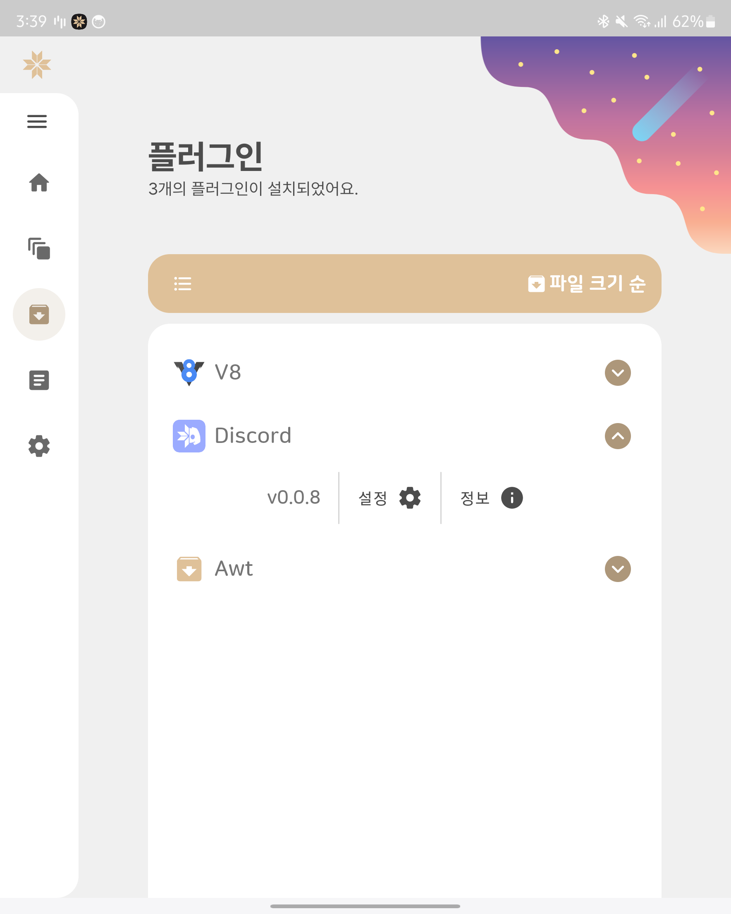
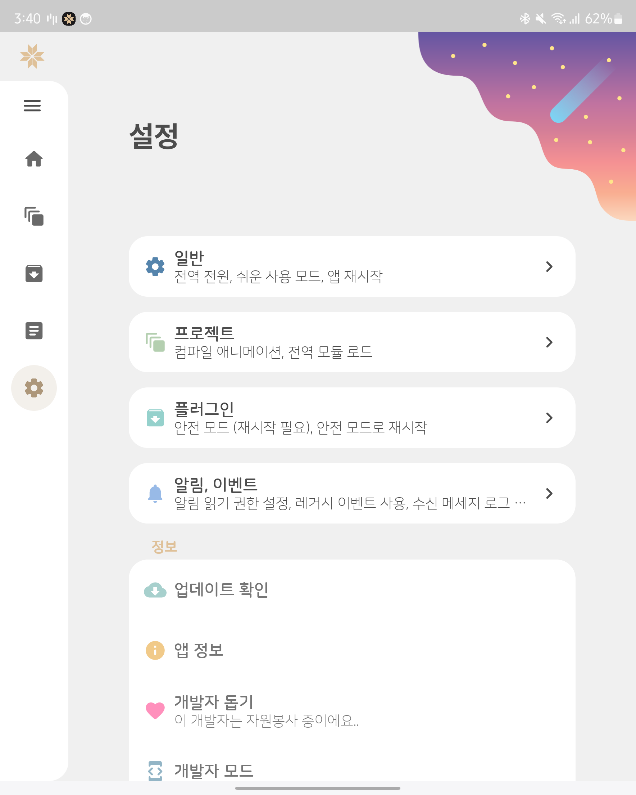
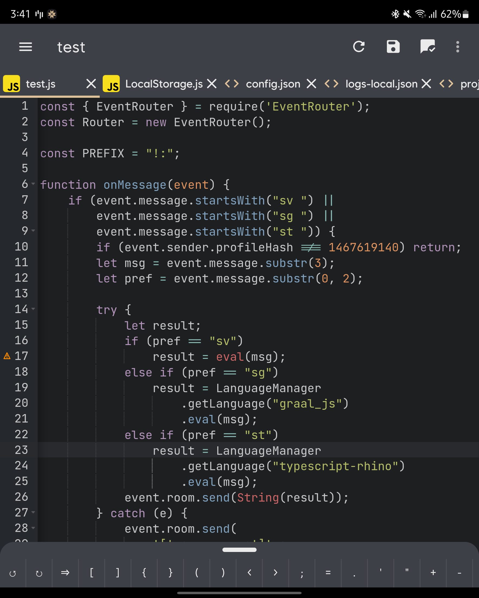

# <h1 align="center"><br>Project StarLight</h1>

<p align="center">
!! Project StarLight is still in development, any bugs can appear !!
</p>

<p align="center">
    <a href="https://developer.android.com"></a>
    <a href="https://kotlinlang.org/"></a>
    <a href="./"></a>
    <a href="./LICENSE"></a>
</p>

<p align="center">
`Project StarLight 🌟` is a Messenger auto-reply application that supports<br>
a variety of script languages and a plugin platform
</p>

<p align="center">
    ✔ Any PRs are welcome, Watch <a href="https://github.com/mooner1022/StarLight/tree/dev">dev</a> branch for recent updates!
</p>

### Screenshots (WIP)
<p align="center">
    
    
    
    
</p>

# License
```
Designed and developed by 2021 mooner1022 (Minki Moon)

This program is free software: you can redistribute it and/or modify
it under the terms of the GNU General Public License as published by
the Free Software Foundation, either version 3 of the License, or
any later version.

This program is distributed in the hope that it will be useful,
but WITHOUT ANY WARRANTY; without even the implied warranty of
MERCHANTABILITY or FITNESS FOR A PARTICULAR PURPOSE.  See the
GNU General Public License for more details.

You should have received a copy of the GNU General Public License
along with this program.  If not, see <http://www.gnu.org/licenses/>.
```
